# 说明
原理图参考这个 [stm32_arduboy_V1.0](https://oshwhub.com/lambda_zhang/stm32_arduboy)

介绍视频参考这个： [stm32_arduboy_V1.0游戏机 - 介绍](https://www.bilibili.com/video/BV11b4y1A7qp/?share_source=copy_web&vd_source=aa0a3cf16c5fa8d0a52107104c68d663)

# 开发
## 开发环境准备
安装必要的软件包
```
$ sudo apt-get install build-essential git gdb-multiarch
```
从[链接](https://developer.arm.com/downloads/-/gnu-rm)下载gcc,找gcc-arm-none-eabi-10.3-2021.10-x86_64-linux.tar.bz2 ，解压到/opt

从[链接](https://gitee.com/xpack-dev-tools/openocd-xpack/releases/tag/v0.11.0-5)下载openocd，找xpack-openocd-0.11.0-5-linux-x64.tar.gz ，解压到/opt

## 编译
以编译ARDUBREAKOUT为例
```
$ export PATH=$PATH:/your/path/gcc-arm-none-eabi-10.3-2021.10/bin
$ make APP_ARDUBREAKOUT=1
```

## 下载到单片机
```
$ /your/path/xpack-openocd-0.12.0-1/bin/openocd -f config/jlink.cfg -f config/stm32f1x.cfg \
-c init -c "reset halt" -c wait_halt \
-c "flash write_image erase build/Arduboy2_stm32f103c8t6.bin 0x08000000" \
-c reset -c shutdown
```

## 调试
```
$ /your/path/xpack-openocd-0.12.0-1/bin/openocd -f config/jlink.cfg -f config/stm32f1x.cfg
$ gdb-multiarch build/Arduboy2_stm32f103c8t6.elf
(gdb) tar ext:3333
```

# 支持的应用和游戏

## 应用

| 应用/游戏名称     | 预览                                | 来源/编译方法                                                | 备注       |
| ----------------- | ----------------------------------- | ------------------------------------------------------------ | ---------- |
| BeepDemo          | 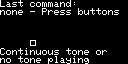        | 来源: [链接](https://github.com/MLXXXp/Arduboy2/tree/master/examples/BeepDemo),[commit](https://github.com/MLXXXp/Arduboy2/commit/bc460a2cff1a3e116880991aa2f88bae4b2e3160)<br />编译方法: make APP_BEEPDEMO=1 | 可正常运行 |
| Buttons           |          | 来源: [链接](https://github.com/MLXXXp/Arduboy2/tree/master/examples/Buttons),[commit](https://github.com/MLXXXp/Arduboy2/commit/bc460a2cff1a3e116880991aa2f88bae4b2e3160)<br />编译方法: make APP_BUTTONS=1 | 可正常运行 |
| FontDemo          | 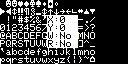        | 来源: [链接](https://github.com/MLXXXp/Arduboy2/tree/master/examples/FontDemo),[commit](https://github.com/MLXXXp/Arduboy2/commit/bc460a2cff1a3e116880991aa2f88bae4b2e3160)<br />编译方法: make APP_FONTDEMO=1 | 可正常运行 |
| HelloWorld        | 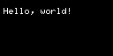      | 来源: [链接](https://github.com/MLXXXp/Arduboy2/tree/master/examples/HelloWorld),[commit](https://github.com/MLXXXp/Arduboy2/commit/bc460a2cff1a3e116880991aa2f88bae4b2e3160)<br />编译方法: make APP_HELLOWORLD=1 | 可正常运行 |
| RGBled            | 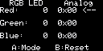          | 来源: [链接](https://github.com/MLXXXp/Arduboy2/tree/master/examples/RGBled),[commit](https://github.com/MLXXXp/Arduboy2/commit/bc460a2cff1a3e116880991aa2f88bae4b2e3160)<br />编译方法: make APP_RGBLED=1 | 可正常运行 |
| SetSystemEEPROM   | 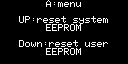 | 来源: [链接](https://github.com/MLXXXp/Arduboy2/tree/master/examples/SetSystemEEPROM),[commit](https://github.com/MLXXXp/Arduboy2/commit/bc460a2cff1a3e116880991aa2f88bae4b2e3160)<br />编译方法: make APP_SETSYSTEMEEPROM=1 | 可正常运行 |
| PlayTune          |         | 来源: [链接](https://github.com/MLXXXp/Arduboy2/tree/master/examples/PlayTune),[commit](https://github.com/MLXXXp/Arduboy2/commit/bc460a2cff1a3e116880991aa2f88bae4b2e3160)<br />编译方法: make APP_PLAYTUNE=1 | 可正常运行 |
| ID-51-EEPROM-TOOL |                                     | 来源: [链接](https://github.com/Team-ARG-Museum/ID-51-EEPROM-TOOL),[commit](https://github.com/Team-ARG-Museum/ID-51-EEPROM-TOOL/commit/68f6802a5bc57fa95ad627c77eb6ec64362750d9)<br />编译方法: make APP_EEPROMTOOL=1 | 可正常运行 |


## 游戏 - 动作/冒险

| 应用/游戏名称                   | 预览                                         | 来源/编译方法                                                | 备注                                                      |
| ------------------------------- | -------------------------------------------- | ------------------------------------------------------------ | --------------------------------------------------------- |
| arduboy-rund-ino                |      | 来源: [链接](https://github.com/flaki/arduboy-rund-ino),[commit](https://github.com/flaki/arduboy-rund-ino/commit/ff8615fd457f08fd3a5ccc0434d67ee31ca87d8d)<br />编译方法: make APP_RUND=1 | 可正常运行                                                |
| arduboy-rund-ino/halloweend     |     | 来源: [链接](https://github.com/flaki/arduboy-rund-ino),[commit](https://github.com/flaki/arduboy-rund-ino/commit/ff8615fd457f08fd3a5ccc0434d67ee31ca87d8d)<br />编译方法: make APP_HALLOWEEND=1 | 可正常运行                                                |
| Ardynia                         |               | 来源: [链接](https://github.com/city41/ardynia),[commit](https://github.com/city41/ardynia/commit/23e1f2449c7f4919eb88f23faa40cbd141d05249)<br />编译方法: make APP_ARDYNIA=1 | 可正常运行，走到图像边缘有bug<br />已经尝试修改但不一定对 |
| CastleBoy                       | 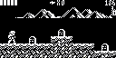            | 来源: [链接](https://github.com/jlauener/CastleBoy),[commit](https://github.com/jlauener/CastleBoy/commit/1d758fdd862d6269dc459661779c52d75cc87f98)<br />编译方法: make APP_CASTLEBOY=1 | 可正常运行                                                |
| Mystic Balloon                  | 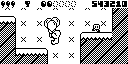 | 来源: [链接](https://github.com/Gaveno/ID-34-Mystic-Balloon),[commit](https://github.com/Gaveno/ID-34-Mystic-Balloon/commit/a2ca9eee92016cf75ec1d6ea9f1126b2403549f5)<br />编译方法: make APP_MYSTICBALLOON=1 | 可正常运行                                                |
| Epic Crates Of Mass Destruction |           | 来源: [链接](https://github.com/Team-ARG-Museum/ID-33-ECOMD),[commit](https://github.com/Team-ARG-Museum/ID-33-ECOMD/commit/c2dac94a6af7cc56389447271935bc322e5aa19b)<br />编译方法: make APP_ECOMD=1 | 可正常运行                                                |
| Helmets & Hordes                |  | 来源: [链接](https://github.com/Team-ARG-Museum/ID-47-Helmets-Hordes),[commit](https://github.com/Team-ARG-Museum/ID-47-Helmets-Hordes/commit/87d1b7e1cc7419be84e078404cbceba58f76a64e)<br />编译方法: make APP_HELMETSHORDES=1 | 不正常                                                    |
| SanSan                          |                | 来源: [链接](http://vxo.jp/arduboy/sansan/sansan.zip)<br />编译方法: make APP_SANSAN=1 | 可正常运行<br />会有图像错误                              |
| Shadow Runner                   |   | 来源: [链接](https://github.com/Team-ARG-Museum/ID-15-Shadow-Runner/tree/master/SHRUN_AB),[commit](https://github.com/Team-ARG-Museum/ID-15-Shadow-Runner/commit/25f277508f28bd379deadba48ff2871f82970344)<br />编译方法: make APP_SHADOWRUNNER=1 | 可正常运行                                                |
| hollow                          |                | 来源: [链接](https://github.com/obono/ArduboyWorks/tree/master),[commit](https://github.com/obono/ArduboyWorks/commit/c0fe2111bfc5df625a8130ffdf5380cdd70b881a)<br />编译方法: make APP_HOLLOW=1 | 可正常运行                                                |
| Rooftop Rescue                  |               | 来源: [链接](https://github.com/BertVeer/Rooftop),[commit](https://github.com/BertVeer/Rooftop/commit/cb8e9203f62f5ce49423742aa3fb7bc6e1ca3847)<br />编译方法: make APP_ROOFTOP=1 | 可正常运行,可能有bug                                      |
| KONG                            |                  | 来源: [链接](https://github.com/Press-Play-On-Tape/Kong),[commit](https://github.com/Press-Play-On-Tape/Kong/commit/ec95141029a2a401edcf97b4b8d0f121139a2d15)<br />编译方法: make APP_KONG=1 | 不正常                                                    |
| Chicken-Cross-Arduboy           |              | 来源: [链接](https://github.com/dragula96/ChickenX),[commit](https://github.com/dragula96/ChickenX/commit/b60c7dcea944838c07e7577e36add23c39360ffb)<br />编译方法: make APP_CHICKENX=1 | 可正常运行                                                |

## 游戏 - 街机

| 应用/游戏名称 | 预览                                  | 来源/编译方法                                                | 备注       |
| ------------- | ------------------------------------- | ------------------------------------------------------------ | ---------- |
| PINBALL       |  | 来源: [链接](https://github.com/Team-ARG-Museum/ID-44-Pinball),[commit](https://github.com/Team-ARG-Museum/ID-44-Pinball/commit/62ec62d27b2ece0e78a7f40f86bb8e41fd5ce2e7)<br />编译方法: make APP_PINBALL=1 | 可正常运行 |

## 游戏 - 格斗

## 游戏 - 休闲益智

| 应用/游戏名称          | 预览                                        | 来源/编译方法                                                | 备注       |
| ---------------------- | ------------------------------------------- | ------------------------------------------------------------ | ---------- |
| 03_tiny_2048           | 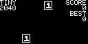        | 来源: [链接](https://github.com/akkera102/03_tiny_2048),[commit](https://github.com/akkera102/03_tiny_2048/commit/4ea9c6b9a0f91fd796e4a3772b7e54520569c427)<br />编译方法: make APP_2048=1 | 可正常运行 |
| Ardu-man               | 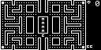             | 来源: [链接](https://github.com/SethRobinson/arduman),[commit](https://github.com/SethRobinson/arduman/commit/3f3af2f503a2255235de8c76a3657407a7b256a1),[PR](https://github.com/SethRobinson/arduman/pull/1)<br />编译方法: make APP_ARDUMAN=1 | 可正常运行 |
| ArduBreakout           |         | 来源: [链接](https://github.com/MLXXXp/Arduboy2/tree/master/examples/ArduBreakout),[commit](https://github.com/MLXXXp/Arduboy2/commit/bc460a2cff1a3e116880991aa2f88bae4b2e3160)<br />编译方法: make APP_ARDUBREAKOUT=1 | 可正常运行 |
| Bomberboy              |            | 来源: [链接](https://github.com/evgenykzz2/Bomberboy),[commit](https://github.com/evgenykzz2/Bomberboy/commit/fe14427e5fdbca0fa0056b798c6475b68fe3b791)<br />编译方法: make APP_BOMBERBOY=1 | 可正常运行 |
| Ardusweeper            | 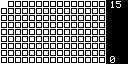         | 来源: [链接](https://github.com/jbellue/minesweeper),[commit](https://github.com/jbellue/minesweeper/commit/c22895784f6f4dbc092f91eb4c06aeab82d7583c)<br />编译方法: make APP_MINESWEEPER=1 | 可正常运行 |
| Flappy Ball            |           | 来源: [链接](https://github.com/MLXXXp/FlappyBall),[commit](https://github.com/MLXXXp/FlappyBall/commit/263e70f240a6811541c3794d2d27bf8323d347a6)<br />编译方法: make APP_FLAPPYBALL=1 | 可正常运行 |
| ArduboyTetris          | 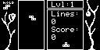       | 来源: [链接](https://github.com/Nautili/ArduboyTetris),[commit](https://github.com/Nautili/ArduboyTetris/commit/3cc72e452c4a7dd3737f72e728e165f666ef9e80)<br />编译方法: make APP_ARDUBOYTETRIS=1 | 可正常运行 |
| Dark-And-Under         | 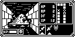      | 来源: [链接](https://hub.nuaa.cf/Garage-Collective/Dark-And-Under),[commit](https://hub.nuaa.cf/Garage-Collective/Dark-And-Under/commit/7dd8f6a03eb179cec12ebc9261ddcb7a88259ce5)<br />编译方法: make APP_DARKANDUNDER=1 | 可正常运行 |
| Bubble PoP             |     | 来源: [链接](https://github.com/Team-ARG-Museum/ID-14-Bubble-PoP),[commit](https://github.com/Team-ARG-Museum/ID-14-Bubble-PoP/commit/17bc3feb1240556dd3ca2b0a0ab0292b9c9eab71)<br />编译方法: make APP_BUBBLEPOP=1 | 可正常运行 |
| ID-10-Dungeons         |                                             | 来源: [链接](https://github.com/Team-ARG-Museum/ID-10-Dungeons),[commit](https://github.com/Team-ARG-Museum/ID-10-Dungeons/commit/ac8ff35bbd6bd74f2a54bfc2b853e581b8c35ecb)<br />编译方法: make APP_DUNGEONS=1 | 不正常     |
| ID-20-Escaper-Droid    |  | 来源: [链接](https://github.com/Team-ARG-Museum/ID-20-Escaper-Droid),[commit](https://github.com/Team-ARG-Museum/ID-20-Escaper-Droid/commit/d8a6bf7274ca917a46213c668164bd99f6f653f5)<br />编译方法: make APP_ESCAPERDROID=1 | 可正常运行 |
| Blob Attack            |    | 来源: [链接](https://github.com/Team-ARG-Museum/ID-28-Blob-Attack),[commit](https://github.com/Team-ARG-Museum/ID-28-Blob-Attack/commit/71d33c8a5df90a27500f27fbe899eacf8f5a0ecd)<br />编译方法: make APP_BLOBATTACK=1 | 可正常运行 |
| BEGEMMED               |       | 来源: [链接](https://github.com/Team-ARG-Museum/ID-30-BEGEMMED),[commit](https://github.com/Team-ARG-Museum/ID-30-BEGEMMED/commit/7dcb1be9e1dd3fb833f8b3933ad259d8c7f4cd03)<br />编译方法: make APP_BEGEMMED=1 | 可正常运行 |
| Reverse Mermaid Hockey |            | 来源: [链接](https://github.com/Team-ARG-Museum/ID-31-RMH),[commit](https://github.com/Team-ARG-Museum/ID-31-RMH/commit/377a31443e4571873d6cdf25e685d2d1269083e1)<br />编译方法: make APP_RMH=1 | 可正常运行 |
| Trolly Fish            |    | 来源: [链接](https://github.com/Team-ARG-Museum/ID-36-Trolly-Fish),[commit](https://github.com/Team-ARG-Museum/ID-36-Trolly-Fish/commit/ddaf606287aded96adf441521b6515b5f86d50f2)<br />编译方法: make APP_TROLLYFISH=1 | 可正常运行 |
| petris                 | 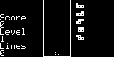              | 来源: [链接](https://github.com/bendapootie/petris),[commit](https://github.com/bendapootie/petris/commit/92dfe5a80b1cc6e46ba0eef71e9d87667a71fc4b)<br />编译方法: make APP_PETRIS=1 | 可正常运行 |
| Minesweeper            |         | 来源: [链接](https://github.com/Pharap/Minesweeper),[commit](https://github.com/Pharap/Minesweeper/commit/2aa548739e025b8067a884e6df88e410633dc38c)<br />编译方法: make APP_MINESWEEPER2=1 | 可正常运行 |

## 游戏 - 棋牌/卡片

| 应用/游戏名称   | 预览                                          | 来源/编译方法                                                | 备注       |
| --------------- | --------------------------------------------- | ------------------------------------------------------------ | ---------- |
| Mini Rogue      | 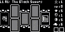             | 来源: [链接](https://github.com/Press-Play-On-Tape/MiniRogue),[commit](https://github.com/Press-Play-On-Tape/MiniRogue/commit/e1309ddbf1ed8d3b5e944dee9f4559ca7a830dfc)<br />编译方法: make APP_MINIROGUE=1 | 可正常运行 |
| DICE of FATE    | 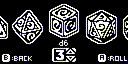    | 来源: [链接](https://github.com/Team-ARG-Museum/ID-37-DICE-of-FATE),[commit](https://github.com/Team-ARG-Museum/ID-37-DICE-of-FATE/commit/d2d7cf40f81e69a64dee461114f79ef8a8e7e714)<br />编译方法: make APP_DICEOFFATE=1 | 可正常运行 |
| Fantasy Rampage |  | 来源: [链接](https://github.com/Team-ARG-Museum/ID-48-Fantasy-Rampage),[commit](https://github.com/Team-ARG-Museum/ID-48-Fantasy-Rampage/commit/29d30d3574e31074aa8bb5d070c073f652b85f1a)<br />编译方法: make APP_FANTASYRAMPAGE=1 | 可正常运行 |

## 游戏 - 模拟/经营

| 应用/游戏名称 | 预览                              | 来源/编译方法                                                | 备注       |
| ------------- | --------------------------------- | ------------------------------------------------------------ | ---------- |
| MicroCity     |  | 来源: [链接](https://github.com/jhhoward/MicroCity),[commit](https://github.com/jhhoward/MicroCity/commit/ae265f1923e9ac9789df601bb438faa29b7ae339)<br />编译方法: make APP_MICROCITY=1 | 可正常运行 |


## 游戏 - 竞速

## 游戏 - 角色扮演

| 应用/游戏名称 | 预览                                      | 来源/编译方法                                                | 备注       |
| ------------- | ----------------------------------------- | ------------------------------------------------------------ | ---------- |
| ARDUVENTURE   |  | 来源: [链接](https://github.com/Team-ARG-Museum/ID-46-Arduventure),[commit](https://github.com/Team-ARG-Museum/ID-46-Arduventure/commit/938fae770f04369ae4e4dd29c1039f7b43e7d96c)<br />编译方法: make APP_ARDUVENTURE=1 | 可正常运行 |

## 游戏 - 射击

| 应用/游戏名称                   | 预览                                          | 来源/编译方法                                                | 备注       |
| ------------------------------- | --------------------------------------------- | ------------------------------------------------------------ | ---------- |
| Catacombs of the damned!        |              | 来源: [链接](https://github.com/jhhoward/Arduboy3D),[commit](https://github.com/jhhoward/Arduboy3D/commit/929db9f3429cc20a318934099d992f1219a081bd)<br />编译方法: make APP_ARDUBOY3D=1 | 可正常运行 |
| VIRUS LQP-79                    |     | 来源: [链接](https://github.com/Team-ARG-Museum/ID-40-VIRUS-LQP-79),[commit](https://github.com/Team-ARG-Museum/ID-40-VIRUS-LQP-79/commit/9f664f0f7b87aca7654d8113b98e41e53c8f5ed0)<br />编译方法: make APP_VIRUSLQP79=1 | 可正常运行 |
| Sirène                          |           | 来源: [链接](https://github.com/Team-ARG-Museum/ID-42-Sirene),[commit](https://github.com/Team-ARG-Museum/ID-42-Sirene/commit/2b96c1dc36fcb40697160bbec77668956d2a4089)<br />编译方法: make APP_SIRENE=1 | 不正常     |
| Outpost Defense                 |  | 来源: [链接](https://github.com/Team-ARG-Museum/ID-49-Outpost-Defense),[commit](https://github.com/Team-ARG-Museum/ID-49-Outpost-Defense/commit/9297095e4b9e074ef28495185a4925d0ff0de0c2)<br />编译方法: make APP_OUTPOSTDEFENSE=1 | 可正常运行 |
| Sunfire                         |          | 来源: [链接](https://github.com/Team-ARG-Museum/ID-50-Sunfire),[commit](https://github.com/Team-ARG-Museum/ID-50-Sunfire/commit/e99fff73e2d7ba974b8fbef90f7adf90c764397b)<br />编译方法: make APP_SUNFIRE=1 | 可正常运行 |
| ArduboyArcodia                  |         | 来源: [链接](https://github.com/thearduinoguy/ArduboyArcodia),[commit](https://github.com/thearduinoguy/ArduboyArcodia/commit/2cb66936676687dcbd00a5990dc82dfce0af77e4)<br />编译方法: make APP_ARDUBOYARCODIA=1 | 可正常运行 |
| CosmicPods                      |             | 来源: [链接](https://github.com/cubic9com/CosmicPods),[commit](https://github.com/cubic9com/CosmicPods/commit/09239199ed828fad80a76707c4b7c170388abcf8)<br />编译方法: make APP_COSMICPODS=1 | 可正常运行 |
| Humanity Revenge Director's Cut | 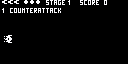   | 来源: [链接](https://github.com/giangregorio/Humanity_Revenge_DC),[commit](https://github.com/giangregorio/Humanity_Revenge_DC/commit/3d5307bba312e6ac66e285f4f0de1294f58dec77)<br />编译方法: make APP_HUMANITYREVENGEDC=1 | 可正常运行 |
| Night Raid                      |             | 来源: [链接](https://github.com/epbarger/night-raid),[commit](https://github.com/epbarger/night-raid)<br />编译方法: make APP_NIGHTRAID=1 | 可正常运行 |
| Omega Chase                     |             | 来源: [链接](https://github.com/Karl-Williams/OmegaChase),[commit](https://github.com/Karl-Williams/OmegaChase/commit/64bc7d38d21fe6684a147554b4b46b043fe6be4f)<br />编译方法: make APP_OMEGACHASE=1 | 可正常运行 |
| SpaceFighter                    |           | 来源: [链接](https://github.com/mhieronymus/SpaceFighter),[commit](https://github.com/mhieronymus/SpaceFighter/commit/89f6144765ce758ed12a6de040a9913fbed492d8)<br />编译方法: make APP_SPACEFIGHTER=1 | 可正常运行 |
| ArduBoy Jet Pac                 | 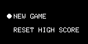        | 来源: [链接](https://github.com/thearduinoguy/ArduBoyJetPack),[commit](https://github.com/thearduinoguy/ArduBoyJetPack/commit/c9f92259414869388117f2ef76defc0a7c7b38f1)<br />编译方法: make APP_ARDUBOYJETPACK=1 | 可正常运行 |
| Glove                           | 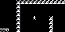                 | 来源: [链接](https://github.com/fuopy/glove),[commit](https://github.com/fuopy/glove/commit/81e9988fea3fc68edc984260b17d6f52beb5d497)<br />编译方法: make APP_GLOVE=1 | 可正常运行 |
| Evade                           | 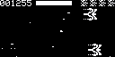    | 来源: [链接](https://github.com/ModusCreateOrg/evade-arduboy-game),[commit](https://github.com/ModusCreateOrg/evade-arduboy-game/commit/0933a8fb3cb78c083e38c7e37124ad3f08f3d90a)<br />编译方法: make APP_EVADE=1 | 可正常运行 |


# 硬件连接

## swd+uart
| STM32F103C8T6 | FUNC           | JLINK | DESC  |
| ------------- | -------------- | ----- | ----- |
| PA9           | USART1_TX      | pin17 | TX    |
| PA13          | SYS_JTMS-SWDIO | pin7  | SWDIO |
| PA14          | SYS_JTCK-SWCLK | pin9  | SWCLK |

## usb
| STM32F103C8T6 | FUNC        | USB     | DESC   |
| ------------- | ----------- | ------- | ------ |
| PA11          | USB_DM      |         | USB_DM |
| PA12          | USB_DP      |         | USB_DP |
| PA8           | GPIO_Output |         | EN     |

## flash
| STM32F103C8T6 | FUNC        | Nor Flash PIN | DESC     |
| ------------- | ----------- | ------------- | -------- |
| PA4           | GPIO_Output | pin1          | CS       |
| PA5           | SPI1_SCK    | pin6          | CLK      |
| PA6           | SPI1_MISO   | pin2          | IO1/MISO |
| PA7           | SPI1_MOSI   | pin5          | IO0/MOSI |

## lcd IRQT17
| STM32F103C8T6 | FUNC        | IRQT17 PIN | DESC |
| ------------- | ----------- | ---------- | ---- |
| PA0           | GPIO_Output |            | BL   |
| PA1           | GPIO_Output | pin4       | CS   |
| PA15          | GPIO_Outout | pin5       | RST  |
| PA3           | GPIO_Outout | pin6       | DC   |
| PB13          | SPI2_SCK    | pin7       | SCL  |
| PB15          | SPI2_MOSI   | pin8       | SDA  |

## e2prom
| STM32F103C8T6 | FUNC     | AT24C02 PIN | DESC |
| ------------- | -------- | ----------- | ---- |
| PB6           | I2C1_SCL | pin6        | SCL  |
| PB7           | I2C1_SDA | pin5        | SDA  |

## led
| STM32F103C8T6 | FUNC        | LED   | DESC   |
| ------------- | ----------- | ----- | ------ |
| PB0           | GPIO_Outout |       | RED    |
| PB1           | GPIO_Outout |       | GREEN  |
| PB2           | GPIO_Outout |       | BLUE   |

## button
| STM32F103C8T6 | FUNC       | BTN   | DESC   |
| ------------- | ---------- | ----- | ------ |
| PB10          | GPIO_Input |       | Left   |
| PB11          | GPIO_Input |       | Right  |
| PB8           | GPIO_Input |       | Up     |
| PB9           | GPIO_Input |       | Down   |
| PC13          | GPIO_Input |       | A      |
| PC14          | GPIO_Input |       | B      |

## speaker
| STM32F103C8T6 | FUNC       | speaker | DESC      |
| ------------- | ---------- | ------- | --------- |
| PB4           | S_TIM3_CH1 |         | SPEAKER_1 |
| PB3           | S_TIM2_CH2 |         | SPEAKER_2 |

## adc (for generateRandomSeed)
| STM32F103C8T6 | FUNC        |           | DESC      |
| ------------- | ----------- | --------- | --------- |
| PA2           | ADC1_EXTI15 |           |           |

# 模块功能和说明
## 音频相关
### TIM2_CH2
产生频率和占空比可以调的PWM，用来输出音符对应的频率来驱动无源蜂鸣器。最高频率1MHZ，占空比分辨率1/500=0.2%
### TIM3_CH1
产生频率和占空比可以调的PWM，用来输出音符对应的频率来驱动无源蜂鸣器。最高频率1MHZ，占空比分辨率1/500=0.2%
### TIM1
产生周期可以配置的定时中断，定时的周期更具不同的音频方案，做不同的配置。
SND1_ARDUBOYPLAYTUNE 配置1KHZ，SND2_ARDUBOYTONES配置1KHZ，SND3_ATMLIB配置31.25KHZ。
### TIM4
产生周期可以配置的定时中断，定时的周期更具不同的音频方案，做不同的配置。
SND1_ARDUBOYPLAYTUNE 配置1KHZ，SND2_ARDUBOYTONES配置1KHZ，SND3_ATMLIB不配置。

# 问题
### 是否支持多个游戏打包到Flash？
不支持。现在使用的stm32f103c8t6的sram只有20KB，同时也不支持FSMC，无法搞一个loder的功能，所以当前版本不打算做多个游戏打包。

目前只能使用JLINK烧写单个游戏到单片机，要换另一个游戏就要重新烧录。

### 是否能通过USB下载？

不支持。还没有做开发。

### 后续计划？

- 使用RP2040再做另外一个版本，这样就可以支持多个游戏打包。具体计划未定。
- 在当前平台好几个游戏有bug，尝试看看能不能在当前平台解决
- EEPROM的支持

